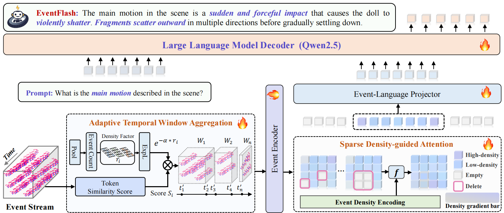

<div align="center">
  
</div>

<div align="center">


# EventFlash: Towards Efficient MLLMs for Event-Based Vision
## <font size=6>🎉 Accepted to ICLR 2026 🎉</font>

<sup>1, 2</sup>[Shaoyu Liu](), <sup>2, *</sup>[Jianing Li](), <sup>1, *</sup>[Guanghui Zhao](), <sup>2</sup>[Yunjian Zhang](),  
<sup>3</sup>[Wen Jiang](), <sup>4, *</sup>[Ming Li](), <sup>2</sup>[Xiangyang Ji]()

<sup>1</sup>Xidian University, <sup>2</sup>Tsinghua University, <sup>3</sup>Beijing Institute of Technology  
<sup>4</sup>Guangdong Laboratory of Artificial Intelligence and Digital Economy (SZ)

</div>


**EventFlash** is an efficient multimodal large language model(MLLM) designed with a spatio-temporal token sparsification strategy, enabling efficient integration of event streams and textual representations.


</div>

## 📖 Abstract

Event-based multimodal large language models (MLLMs) enable robust perception in high-speed and low-light scenarios, overcoming key limitations of frame-based MLLMs. However, existing methods often adopt dense image-like processing, neglecting the inherent spatiotemporal sparsity of event streams and incurring high computational cost.We propose EventFlash, an efficient MLLM that leverages spatiotemporal token sparsification to reduce redundancy and accelerate inference. We construct EventMind, a large-scale and diverse dataset with over 500k instruction sets, supporting curriculum training with both short and long event sequences. EventFlash incorporates an adaptive temporal window aggregation module for efficient temporal compression and a sparse density-guided attention module to enhance spatial token efficiency. Experiments show that EventFlash achieves a 12.4× throughput improvement over EventFlash-Zero while maintaining comparable performance, and supports long-range processing up to 1,000 bins, significantly surpassing the 5-bin limit of EventGPT. 

<div align=center>

</div>

## ⚙️ Setup

Create 

```
conda create -n eventflash python=3.10
conda activate eventflash
```

Install pytorch

```
conda install pytorch==2.1.2 torchvision==0.16.2 torchaudio==2.1.2 pytorch-cuda=12.1 -c pytorch -c nvidia
```

Other requirments

```
pip install -r requirments.txt
```


